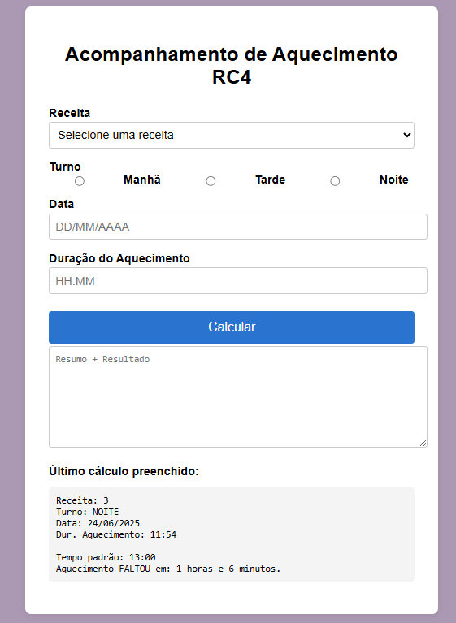

# 🦺 Acompanhamento RC4

Este projeto é um aplicativo web para acompanhamento do processo de aquecimento RC4, desenvolvido em HTML, CSS e JavaScript, totalmente offline e sem necessidade de instalação.

## Funcionalidades

- Interface amigável para entrada de dados do processo (receita, turno, data, duração do aquecimento).
- Cálculo automático do tempo padrão e comparação com o tempo informado.
- Exibição de um resumo dos dados preenchidos e do resultado do cálculo, pronto para ser copiado.
- Armazena o último cálculo preenchido no navegador.
- Compatível com Windows, Mac e Linux (basta abrir o arquivo index.html em qualquer navegador moderno).

## Como executar

1. Baixe ou clone este repositório.
2. Abra o arquivo `index.html` em seu navegador (Google Chrome, Edge, Firefox, etc.).
3. Preencha o formulário, clique em "Calcular" e veja o resultado.

## Tecnologias utilizadas

- HTML5
- CSS3
- JavaScript (puro)

## Imagem do aplicativo

---

Desenvolvido para facilitar o acompanhamento e controle do processo RC4 de forma simples, segura e acessível.